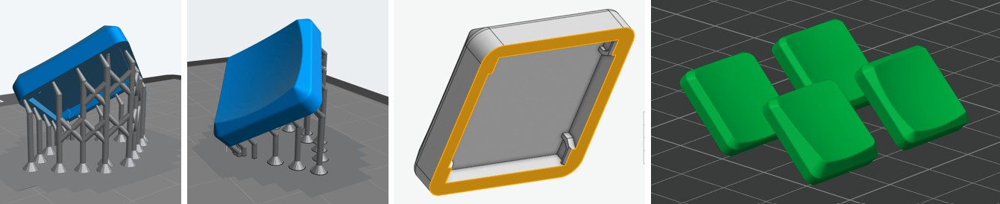
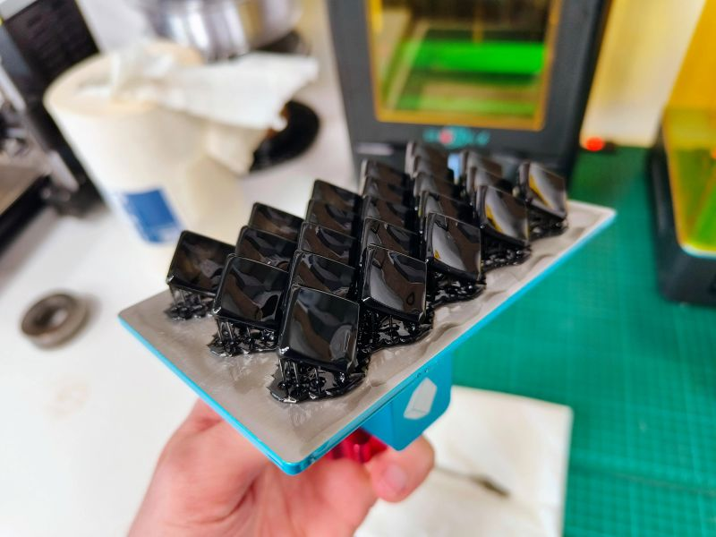
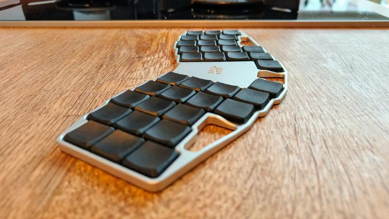
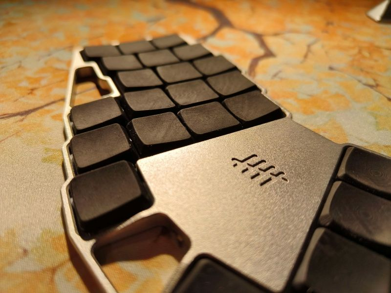
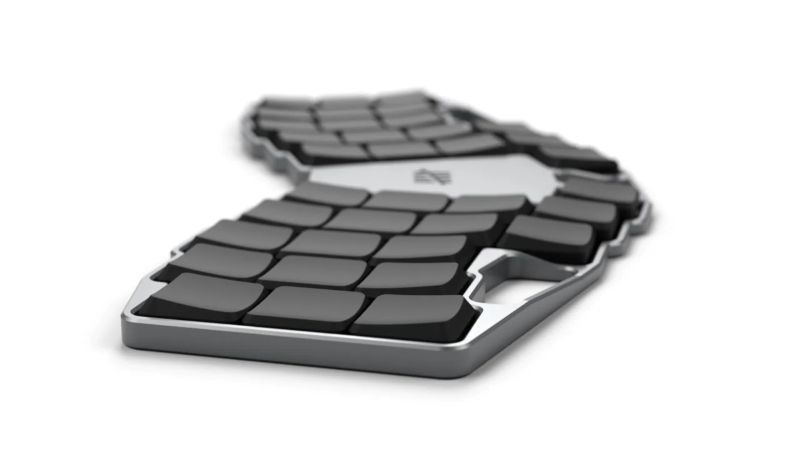

# Custom Keycaps: READ ME FIRST!
### I STRONGLY ADVISE NOT TO HAVE THESE FILES RESIN PRINTED AT A COMMERCIAL PRINT SERVICE!
I have successfully printed these keycaps on my OWN resin printer. I tuned all dimensions for a good fit using my OWN printer. After tuning them to perfection I ordered them at JLC and received keycaps with a very bad finish and fit, even different fits between individual keycaps. 

Especially for resin printing, many variables influence the dimensions of the printed part: slicing orientation and settings, material properties, shrinkage, washing time, curing intensity, abrasive post-processing, and who knows what. Since these keycaps require very precise dimensions to have a tight fit on the switch without rattle but not too tight to prevent the switch from getting stuck, resin printing somewhere else is therefore far from ideal. 

## Well, what should I do with these files then?
Ideally, print them on your own printer. Start with a couple and tweak the scale or even individual part dimensions to get a better fit. I have heard testers get good results from scaling the part 101%, for example. I printed them in the orientation shown below, and I only supported the outer (orange-marked) edge to minimize/eliminate cleanup. The right image is how I oriented them for an FDM print on my new Bambu X1C using 0.08mm layer height, and it worked surprisingly well!

I was able to print a nice batch on my relatively small build platform of a our Anycubic Photon S printer, a relatively old printer, but still works pretty well.

## What if I don't have a printer?
MJF printing should be a better option as all of those machines are from the same manufacturer (HP) and use proprietary materials and software. They are known to produce very repeatable part dimensions from wherever you have them printed. If you can live with the slightly grainy and grippy texture, I would advise going with MJF. If somebody finds the magic instructions to order MJF printed caps with a perfect fit, let me know!

# Two types of keycaps
### Normal type
This is a design similar to MBK caps which are very popular in the low profile community. For the thumbs there is a modified version with a less sharp bottom edge.

)

### Keywell type
A popular concept nowadays. The thumb keycaps are the same as the top and bottom row.

## Can I use these models for production and sale?
Yes. But you must leave a mention of this repository/author to end users.

## Can I modify, fork, post (or whatever) these models?
Yes. Rules are the same. Give a credit to the author.

