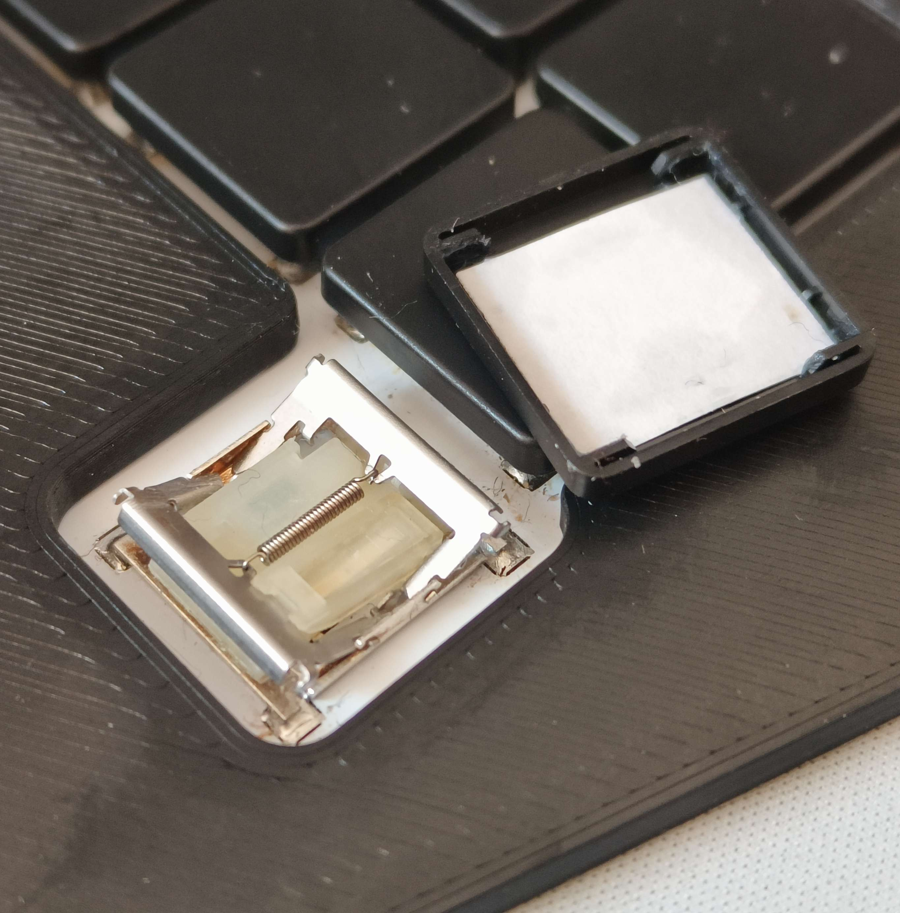

# Kailh PG1316S mods
You just built your first PG1316S keyboard. You spent hours and hours making all of your switches work on your PCB, and then you start typing. Dang, these switches sure feel and sound different. And then you find out your PG1316S doubles as a musical rhythm instrument when you shake it.

No worries. I got you covered. All you need to make your fresh PG1316S keyboard sound and feel a lot better is here :)

I spend a good chunk of time trying to solve these issues by making custom 3D-printed keycaps, which work well to eliminate rattle and improve the sound. But dimensional tolerances are very tight, and these caps are not the easiest to print. I wanted a quick solution that could be used to improve the stock switch and keycap without much effort. The result was two 'papermods', which anybody with a pair of scissors and a piece of paper can do. 

## Papermod1
The papermod1 is just a rectangular piece of paper measuring 13.8x12.7mm that eliminates the play between PG1316S switch and the stock keycap and causes the rattle. This makes the switch feel more robust and silent. Just put it under the keycap as shown in the image, and BAM, instant improvement. Try different thicknesses of paper or even different materials and see what you like best.

## Papermod2 (with VIDEO!)
Papermod1 is cool, but it still has a relatively hard bottom out. Which you might like, or not. Papermod2 prevents the hard bottom out by reducing the stroke by the height of 2 pieces of paper (about 0.2mm) attached to the sides of papermod1. Both bottom out and sound are softer because the metal pieces inside the switch don't clash with each other anymore. 

You can download the papermod2 [video](PG1316S_papermod2.mp4) (.mp4 file) above by clicking on it and downloading the raw file using the button in the top right on the next screen. The video shows how to fold papermod2 and demonstrates the difference in sound between (1) stock, (2) papermod1, and (3) papermod2.

## Papermod cutting template!
There is a PDF with cutting template for both papermods in one, the source InkScape file, and a DXF of a separate papermod2 piece if you have a lasercutter at hand. Just download, print, cut, and try. Try one keycap first. It's easy and fast.

## Note on different stock color keycaps!
I tested these papermods on the BLACK stock keycaps. I have experienced that the transparent keycaps (I have) have a slightly tighter fit. You might need a thinner piece of paper to prevent having a too tight fit that can block the motion of the switch.

## Legends and colors using the stock transparent keycaps!
Putting paper below the transparent keycaps does not look very nice. Unless you use some colored paper. And put some legends on it to learn you fresh new layout! Because who uses QWERTY nowadays? Not you right? RIGHT?! OK. Then we are cool.

## Lubing the switches and keycaps
Yes, for science, I lubed these switches and keycaps. Every hinge that moves or parts that slide on each other were given a minimal amount of Krytox 205g0 using a tiny brush. And well, it helps in making the switches feel smoother, it really does. Most keyboard switches are factory lubed a bit, so why not these? I also managed to eliminate a squeaky noise coming from one of the switches this way. It's a relatively expensive and time-consuming mod, but far from the time you need to lube box switches found on other keebs. When you feel ready for a zen task just take off the keycaps, apply lube, repeat, and enjoy ;)
